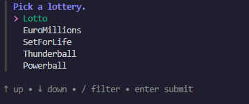

# lottery

Play National Lottery from your terminal.




## Install

```console
go install github.com/onyx-and-iris/lottery-cli/cmd/lottery@latest
```

## Special Thanks

-   [spf13](https://github.com/spf13) for the [cobra](https://github.com/spf13/cobra)
-   [Charm](https://github.com/charmbracelet) developers for the [fang](https://github.com/charmbracelet/fang), [lipgloss](https://github.com/charmbracelet/lipgloss) and [huh](https://github.com/charmbracelet/huh) packages.